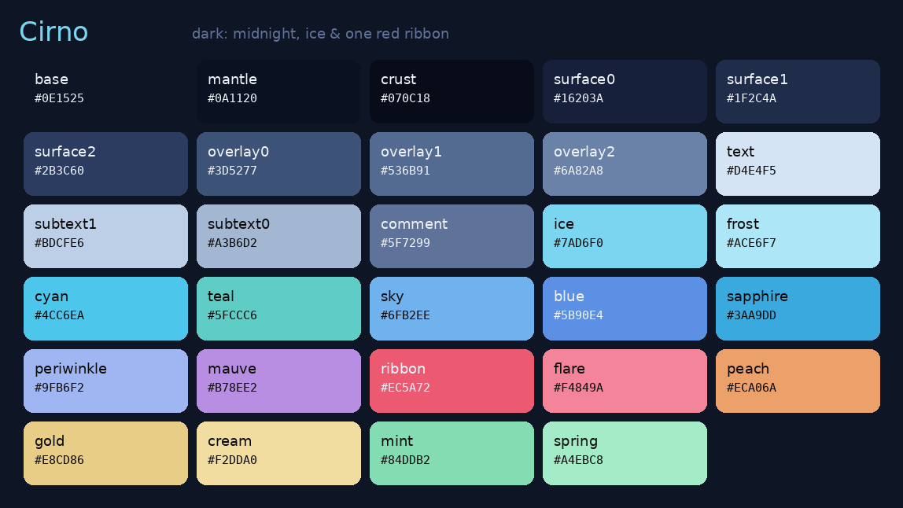
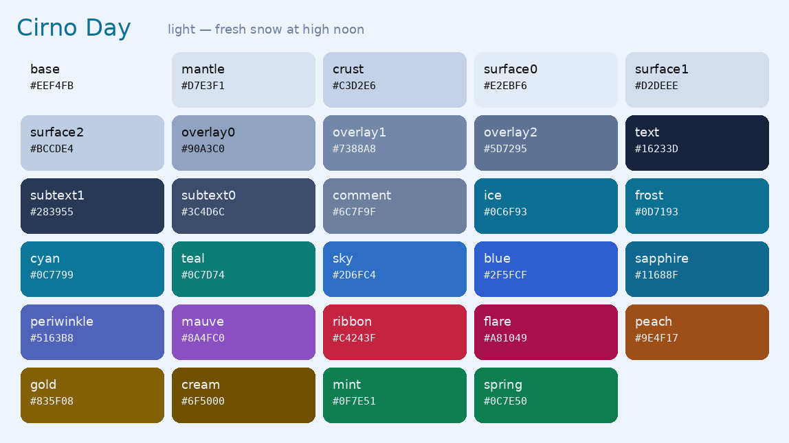

<div align="center">

# ❄️ Cirno

**An ice-fairy theme for your whole desktop.**
Midnight navy, starlight blue, ice-cyan — and one red ribbon.


<sub>Named for [Cirno](https://en.touhouwiki.net/wiki/Cirno), the ⑨ ice fairy of the Touhou Project. The palette is sampled from the wallpaper above — art by [@azumammeri](https://x.com/azumammeri/status/1487768625666994178).</sub>


</div>

---

## The palette

Two variants — **Cirno** (dark) and **Cirno Day** (light) — both contrast-checked
to clear WCAG AA.




The full rationale — the color theory, the surface ramp, the role map — lives in
**[`palette/PALETTE.md`](palette/PALETTE.md)**. The machine-readable source of
truth is **[`palette/cirno.json`](palette/cirno.json)**.

> **One cool base, one warm accent.** The theme lives almost entirely in the blue
> half of the colour wheel; the single red ribbon does all the "stop / error /
> attention" work, so it reads instantly without ever shouting.

## What's inside

30 apps, 48 files. Dark everywhere; light (**Cirno Day**) where the format supports it.

### Terminals

| App | File | Install |
|-----|------|---------|
| **Ghostty** | [`themes/ghostty/cirno`](themes/ghostty/cirno) | copy to `~/.config/ghostty/themes/`, then `theme = cirno` |
| **Kitty** | [`themes/kitty/cirno.conf`](themes/kitty/cirno.conf) | `include` it from `kitty.conf` |
| **Alacritty** | [`themes/alacritty/cirno.toml`](themes/alacritty/cirno.toml) | add to `[general] import` in `alacritty.toml` |
| **WezTerm** | [`themes/wezterm/cirno.toml`](themes/wezterm/cirno.toml) | drop in `~/.config/wezterm/colors/`, set `color_scheme = "Cirno"` |
| **foot** | [`themes/foot/cirno.ini`](themes/foot/cirno.ini) | `include` it from `foot.ini` |

### Multiplexers

| App | File | Install |
|-----|------|---------|
| **tmux** | [`themes/tmux/cirno.tmux`](themes/tmux/cirno.tmux) | `run-shell ~/.../cirno.tmux` in `tmux.conf` |
| **Zellij** | [`themes/zellij/cirno.kdl`](themes/zellij/cirno.kdl) | copy to `~/.config/zellij/themes/`, set `theme "cirno"` |

### Editors

| App | File | Install |
|-----|------|---------|
| **VS Code** | [`themes/vscode/`](themes/vscode/) | symlink into `~/.vscode/extensions/` or package a `.vsix` — see its [README](themes/vscode/README.md) |
| **Neovim** | [`themes/neovim/`](themes/neovim/) | Lua plugin: `require("cirno").setup{}` then `colorscheme cirno` — see its [README](themes/neovim/README.md) |
| **Vim** | [`themes/vim/colors/cirno.vim`](themes/vim/colors/cirno.vim) | copy to `~/.vim/colors/`, then `colorscheme cirno` |
| **Helix** | [`themes/helix/cirno.toml`](themes/helix/cirno.toml) | copy to `~/.config/helix/themes/`, set `theme = "cirno"` |

### Desktop (Wayland)

| App | File | Install |
|-----|------|---------|
| **DankMaterialShell** | [`themes/dms/cirno.json`](themes/dms/cirno.json) | point `customThemeFile` at it, set `currentThemeName: "custom"` |
| **Waybar** | [`themes/waybar/cirno.css`](themes/waybar/cirno.css) | `@import` from your Waybar `style.css` |
| **Rofi** | [`themes/rofi/cirno.rasi`](themes/rofi/cirno.rasi) | `@theme` it, or `rofi -theme cirno` |
| **Wofi** | [`themes/wofi/cirno.css`](themes/wofi/cirno.css) | `wofi --style cirno.css` |
| **Hyprland** | [`themes/hyprland/cirno.conf`](themes/hyprland/cirno.conf) | `source = ~/.../cirno.conf` in `hyprland.conf` |
| **mako** | [`themes/mako/cirno.ini`](themes/mako/cirno.ini) | `include` from `~/.config/mako/config` |
| **dunst** | [`themes/dunst/cirno.conf`](themes/dunst/cirno.conf) | merge into `dunstrc` |
| **swaylock** | [`themes/swaylock/cirno.conf`](themes/swaylock/cirno.conf) | copy to `~/.config/swaylock/config` |
| **GTK / libadwaita** | [`themes/gtk/`](themes/gtk/) | copy into `~/.config/gtk-4.0/` (and `gtk-3.0/`) |

### Shell & prompt

| App | File | Install |
|-----|------|---------|
| **Starship** | [`themes/starship/cirno.toml`](themes/starship/cirno.toml) | use as `~/.config/starship.toml` |
| **fish** | [`themes/fish/cirno.theme`](themes/fish/cirno.theme) | drop in `~/.config/fish/themes/`, `fish_config theme save Cirno` |
| **zsh** | [`themes/zsh/cirno.zsh`](themes/zsh/cirno.zsh) | `source` after `zsh-syntax-highlighting` |
| **fzf** | [`themes/fzf/`](themes/fzf/) | `source` the file for your shell (`.sh` / `.zsh` / `.fish`) |

### CLI tools

| App | File | Install |
|-----|------|---------|
| **bat** | [`themes/bat/Cirno.tmTheme`](themes/bat/Cirno.tmTheme) | copy to bat's `themes/`, `bat cache --build`, `--theme=Cirno` |
| **delta** | [`themes/delta/cirno.gitconfig`](themes/delta/cirno.gitconfig) | `[include] path = …` from `~/.gitconfig` |
| **lazygit** | [`themes/lazygit/cirno.yml`](themes/lazygit/cirno.yml) | merge the `gui.theme` block into `config.yml` |
| **yazi** | [`themes/yazi/cirno.toml`](themes/yazi/cirno.toml) | copy to `~/.config/yazi/theme.toml` |
| **btop** | [`themes/btop/cirno.theme`](themes/btop/cirno.theme) | copy to `~/.config/btop/themes/`, set `color_theme` |
| **fastfetch** | [`themes/fastfetch/cirno.jsonc`](themes/fastfetch/cirno.jsonc) | use as `~/.config/fastfetch/config.jsonc` |

> Each theme file opens with a comment header giving its exact one-line install.

## Repo layout

```
cirno/
├── palette/
│   ├── cirno.json      ← single source of truth (variants · ANSI · roles)
│   └── PALETTE.md      ← the colour theory + full token tables
├── themes/<app>/       ← one directory per app (30 of them)
├── scripts/
│   ├── build_palette.py ← regenerate cirno.json + WCAG contrast check
│   └── swatches.py      ← render the preview images
├── assets/             ← palette previews
└── wallpaper/cirno.jpeg
```

## Regenerating

The palette is built and verified from one script — no hand-edited copies drift:

```sh
python3 scripts/build_palette.py   # → palette/cirno.json, asserts WCAG AA
python3 scripts/swatches.py        # → assets/*.png
```

## Contributing

Porting Cirno to another app is welcome. Pull the exact values from
[`palette/cirno.json`](palette/cirno.json), follow the role map in
[`PALETTE.md`](palette/PALETTE.md), add `themes/<app>/`, and list it in the table
above. Keep accents at WCAG AA against the background they render on.

## Credits & license

Theme files are released under the [MIT License](LICENSE). The wallpaper depicts
**Cirno** from the **Touhou Project** by Team Shanghai Alice (ZUN); the artwork is
by **[@azumammeri](https://x.com/azumammeri/status/1487768625666994178)** and is
included for personal theming use under ZUN's fan-work guidelines. All rights to
the artwork and to Touhou belong to their respective creators.

<div align="center"><sub>⑨ the strongest</sub></div>
